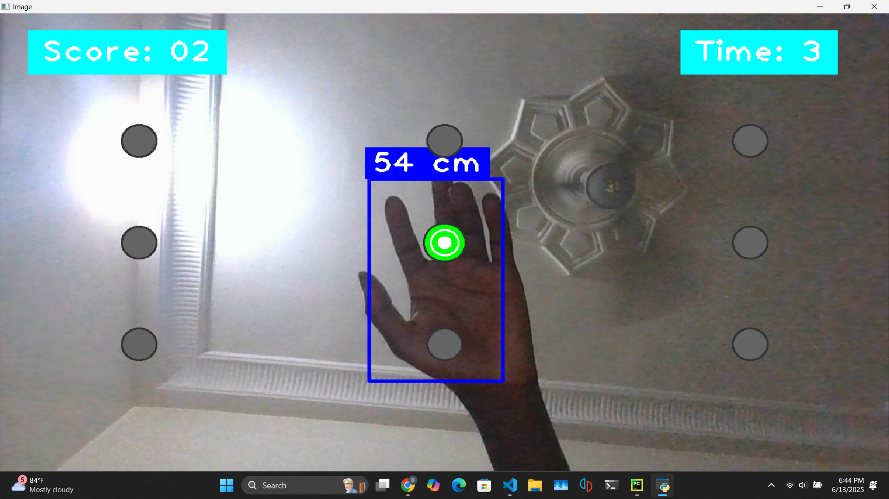

# Hand Distance Game 

An interactive hand tracking reflex game that uses computer vision to detect hand gestures and estimate real world distances. Players "hit" targets, demonstrating practical applications of polynomial regression and computer vision.

## Demo




## Features

- **Real time Hand Tracking**: Uses computer vision to track hand movements via webcam
- **Distance Estimation**: Converts pixel distances to real world measurements using polynomial regression
- **Interactive Gameplay**: 30 second reflex game with scoring system
- **Grid based Targets**: 3x3 target grid for varied difficulty
- **Visual Feedback**: Dynamic color changes and visual cues
- **Educational Tool**: Perfect for demonstrating mathematical concepts in action

## The Math Behind It

The game uses polynomial regression to convert pixel distances to centimeters:

```python
# Calibration data: pixel distance vs real world distance
x = [300, 245, 200, 170, 145, 130, 112, 103, 93, 87, 80, 75, 70, 67, 62, 59, 57]  # pixels
y = [20, 25, 30, 35, 40, 45, 50, 55, 60, 65, 70, 75, 80, 85, 90, 95, 100]      # cm

# Polynomial fit: distance_cm = A*pixels² + B*pixels + C
coefficients = np.polyfit(x, y, 2)
```

This demonstrates practical applications of:
- Data collection and calibration
- Polynomial regression
- Real time mathematical modeling
- Computer vision coordinate systems

## Installation

### Prerequisites

- Python 3.7+
- Webcam (built-in or external)

### Setup

1. **Clone the repository**
   ```bash
   git clone https://github.com/donsolo-khalifa/HandDistanceGame.git
   cd HandDistanceGame
   ```

2. **Install dependencies**
   ```bash
   pip install opencv-python cvzone numpy mediapipe
   ```

   Or use the requirements file:
   ```bash
   pip install -r requirements.txt
   ```

3. **Run the game**
   ```bash
   python hand_distance_game.py
   ```

## How to Play

1. **Setup**: Make sure your webcam is connected and working
2. **Position**: Sit a reasonable distance away from your camera 
3. **Gameplay**: 
   - Targets appear in a 3x3 grid on screen
   - "Hit" targets by tapping targets with your palm
   - Score as many targets as possible in 30 seconds
4. **Controls**:
   - `Q`: Quit the game
   - `R`: Restart after game over

## Educational Use

This project was originally created as a teaching tool to demonstrate:

### Mathematical Concepts
- **Polynomial Regression**: Real world curve fitting
- **Data Collection**: Scientific method in practice  
- **Statistical Modeling**: Making predictions from data
- **Coordinate Systems**: 2D spatial relationships

## Technical Details

### Dependencies
- **OpenCV**: Computer vision and webcam handling
- **CVZone**: Simplified hand tracking wrapper
- **NumPy**: Mathematical operations and polynomial fitting
- **MediaPipe**: Hand landmark detection (via CVZone)

### Key Components
```python
# Hand detection with confidence threshold
detector = HandDetector(detectionCon=0.5, maxHands=2)

# Distance calculation between thumb and pinky landmarks
distance = math.sqrt((y2 - y1) ** 2 + (x2 - x1) ** 2)

# Real-world distance estimation
distanceCM = A * distance ** 2 + B * distance + C
```

### Performance
- Runs at ~30 FPS on most modern computers
- Requires minimal CPU resources
- Works with any standard webcam

## Customization

### Game Parameters
```python
# Timing
totalTime = 30  # Game duration in seconds

# Grid layout
rows, cols = 3, 3  # Target grid size

# Detection sensitivity
distanceThreshold = 100  # Maximum distance in cm for target hits
```


---

⭐ **Star this repo if you found it helpful for teaching or learning!**

*Made with ❤️ for education and the joy of learning*